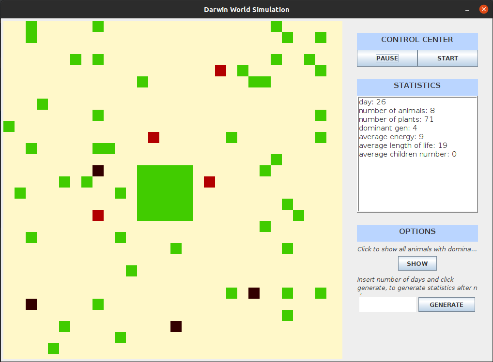

# DarwinSimulation

Project implemented during Object-Oriented Programming classes at AGH UST. Application allows running simulation that visualizes evolution process. Simulation contains animals and environment. Animals can move, eat plants and reproduce. User can change simulation properties, such as map size, number of generated plants, animals length of life etc. More detailed description may be found here: https://github.com/apohllo/obiektowe-lab/tree/master/proj1.

